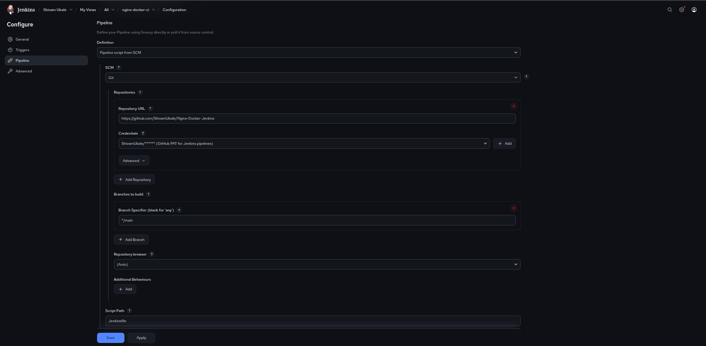
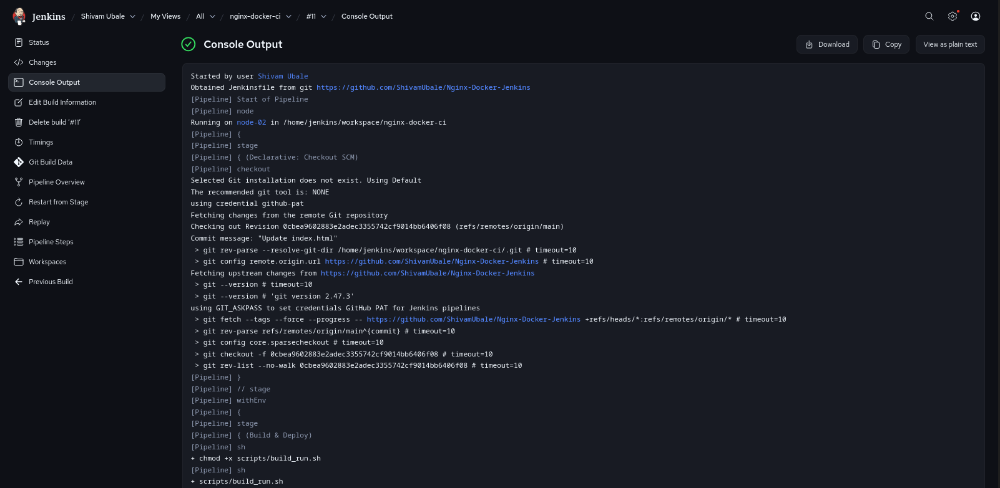
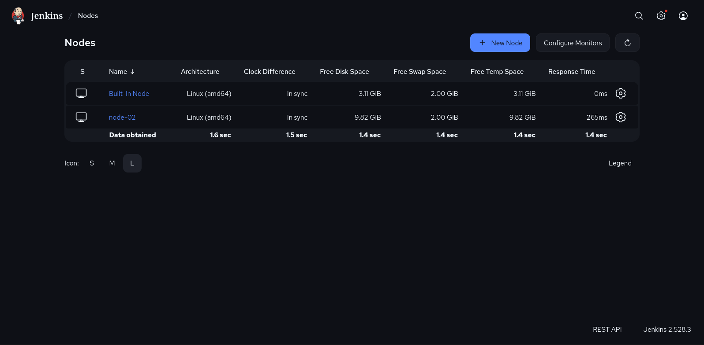
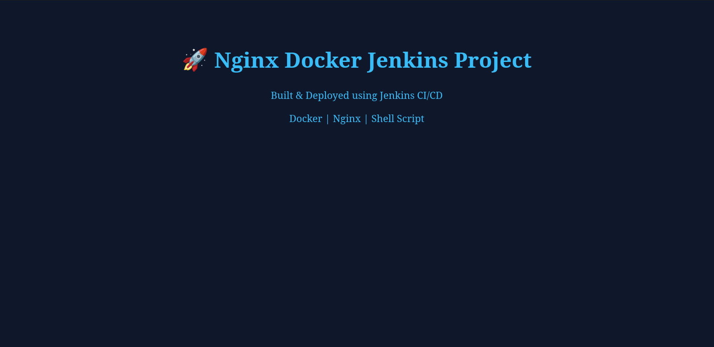

# 🚀 Jenkins CI/CD Pipeline – Dockerized Nginx Web App

A **beginner-to-intermediate DevOps project** demonstrating a real-world CI/CD workflow using **GitHub, Jenkins, Docker, and Nginx** with a **dedicated Jenkins agent (node-02)**.

This project is designed to be **clean, professional, reusable**, and easy for others to understand and extend.

---

## 📌 Project Overview

This project automates the process of:

1. Pulling source code from **GitHub**
2. Building a **Docker image** with **Nginx**
3. Serving a static **HTML website**
4. Running everything via a **Jenkins Pipeline** on a **remote Jenkins agent (node-02)**

It follows **real DevOps practices** like:

* Agent-based execution
* Secure GitHub authentication (PAT)
* Script-based Docker automation

---

## 🧱 Architecture

```
Developer → GitHub → Jenkins Controller
                     ↓
               Jenkins Agent (node-02)
                     ↓
                 Docker Engine
                     ↓
                  Nginx Container
                     ↓
                Web App in Browser
```

---

## 🛠️ Tech Stack

| Tool    | Purpose                |
| ------- | ---------------------- |
| GitHub  | Source code repository |
| Jenkins | CI/CD automation       |
| Docker  | Containerization       |
| Nginx   | Web server             |
| Linux   | Jenkins nodes          |

---

## 📁 Repository Structure

```
nginx-docker-jenkins/
│
├── nginx/
│   ├── Dockerfile
│   └── index.html
│
├── scripts/
│   └── build_run.sh
├── Jenkinsfile
└── README.md
```

---

## 📄 File Explanations

### 🔹 `nginx/Dockerfile`

```dockerfile
FROM nginx:alpine
COPY index.html /usr/share/nginx/html/index.html
EXPOSE 80
```

### 🔹 `nginx/index.html`

```html
<!DOCTYPE html>
<html>
<head>
    <title>Jenkins Docker Nginx Test</title>
</head>
<body>
    <h1>Hello, Jenkins CI/CD!</h1>
</body>
</html>
```

### 🔹 `scripts/build_run.sh`

```bash
#!/bin/bash

# Stop old container if running
docker stop nginx-test || true
docker rm nginx-test || true

# Build Docker image
docker build -t nginx-test ./nginx

# Run container
docker run -d --name nginx-test -p 8080:80 nginx-test
```

### 🔹 `Jenkinsfile`

```groovy
pipeline {
    agent { label 'docker' }

  stages {
    stage('Build & Deploy') {
      steps {
        sh 'chmod +x scripts/build_run.sh'
        sh 'scripts/build_run.sh'
      }
    }
    stage('Verify') {
      steps {
        sh 'docker ps | grep nginx-container'
      }
    }
  }
}
```

---

## ⚙️ Prerequisites

### Jenkins Controller

* Jenkins installed
* Git plugin enabled
* GitHub credentials configured (PAT)

### Jenkins Agent (node-02)

* Docker installed
* Jenkins user created
* Agent connected and **ONLINE**

> ❗ Jenkins **does NOT need to be installed** on node-02

---

## 🔐 GitHub Authentication (PAT)

This project uses **GitHub Personal Access Token (PAT)** for secure authentication.

Configured in:

```
Jenkins → Manage Jenkins → Credentials → Global
```

Credential Type:

* **Username with password**
* Username: your GitHub username
* Password: GitHub PAT

---

## ▶️ Jenkins Pipeline Configuration

### Job Type

* **Pipeline**

### Pipeline Definition

* Pipeline script from SCM

### SCM Settings

```
SCM: Git
Repository URL: https://github.com/<YOUR_USERNAME>/nginx-docker-jenkins.git
Credentials: github-pat
Branch: */main
```

### Agent Label

```
node-02
```

### Script Path

```
Jenkinsfile
```

---

## 🌐 Output Verification

After a successful build, check:

* Docker container running:

```bash
docker ps
```

* Web page in browser:

```
http://<node-02-ip>:8080
```

### Suggested Screenshots

| Screenshot                                       | Description                                   |
| ------------------------------------------------ | --------------------------------------------- |
|  | Jenkins pipeline configuration page           |
|     | Jenkins console output after successful build |
|    | Node-02 online status in Jenkins              |
|         | Docker container running on node-02           |
|    | Nginx web page displayed in browser           |

> 📁 Place all screenshots inside a `/screenshots` folder

---

## 🧠 What This Project Demonstrates

✅ Real CI/CD workflow

✅ Jenkins controller–agent architecture

✅ Dockerized deployments

✅ Secure GitHub authentication

✅ Industry-relevant DevOps skills

---

## 🚀 Possible Enhancements

* Push image to Docker Hub
* Add version tagging
* Integrate Nginx reverse proxy
* Add Kubernetes deployment
* Add Ansible-based provisioning

---

## 👤 Author

**Shivam Ubale**
Aspiring DevOps Engineer

---
